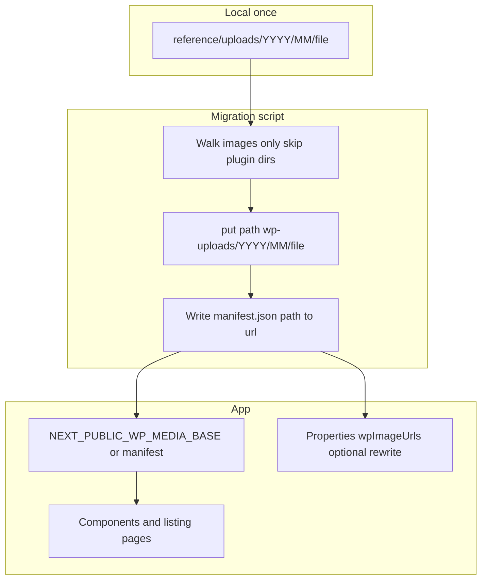

# Migrate `reference/uploads` to Vercel Blob (programmatic)

## Context (updated)

- **Source tree:** [`reference/uploads`](reference/uploads) — gitignored in [`.gitignore`](.gitignore), mirrors WordPress `wp-content/uploads` layout (`YYYY/MM/filename.ext`). **~52,500 image files** plus plugin/import cruft (`wpallimport/`, `siteground-optimizer-assets/`, etc.).
- **URL mapping:** Anything that was `https://momentumrg.com/wp-content/uploads/2022/03/foo.jpg` should map to the **same relative path** under a stable Blob prefix, e.g. `wp-uploads/2022/03/foo.jpg`, so rewrites are mechanical and scriptable.
- **Not homepage-only:** Marketing hardcodes + **property galleries** (`wpImageUrls`, import scripts) can all target the same Blob base once paths align.
- **Existing infra:** [`apps/app/src/payload.config.ts`](apps/app/src/payload.config.ts) already enables `vercelBlobStorage` for the **`media`** collection (`BLOB_READ_WRITE_TOKEN`). That covers **admin uploads**; a **bulk migration** of 52k files should use **`@vercel/blob` `put`** directly (same token) unless you explicitly want 52k Payload `media` rows (heavy DB + admin noise — not recommended for every property JPEG).

## Recommended architecture

1. **Bulk upload script** (new file under `apps/app/scripts/`, e.g. `upload-wp-media-to-blob.ts`):
   - **Input root:** `reference/uploads` (or env `WP_UPLOADS_ROOT`).
   - **Include:** image extensions only (jpg, jpeg, png, webp, gif, svg).
   - **Exclude (default):** `wpallimport/`, `siteground-optimizer-assets/`, `wp-file-manager-pro/`, `theplus-addons/`, and other obvious non-media subtrees; make exclusions configurable.
   - **Blob key:** deterministic pathname, e.g. `wp-uploads/2013/04/photo.jpg` — set **`addRandomSuffix: false`** so the same file always maps to the same public URL (required for stable rewrites).
   - **Idempotency:** maintain a local **`upload-manifest.json`** (path → `url`) updated after each successful `put`; on rerun, skip paths already in manifest (survives interruptions).
   - **Concurrency:** bounded parallel uploads (e.g. 5–10) to avoid rate limits / memory spikes.
   - **Dry run:** `--dry-run` counts files and prints sample paths without uploading.

2. **Rewrite layer in the app**
   - Add a small helper, e.g. `src/lib/wpMediaUrl.ts`: given relative path `2022/03/Karl-Parize-Realtor-1.jpg`, returns `` `${process.env.NEXT_PUBLIC_WP_MEDIA_BASE}/wp-uploads/2022/03/Karl-Parize-Realtor-1.jpg` `` (exact prefix must match the script).
   - Replace hardcoded `https://momentumrg.com/wp-content/uploads/...` across `apps/app/src` with that helper or with constants that use it.
   - **Environment:** `NEXT_PUBLIC_WP_MEDIA_BASE=https://<store>.public.blob.vercel-storage.com` (no trailing slash) — set in Vercel project settings.

3. **Next.js images**
   - Extend [`apps/app/next.config.ts`](apps/app/next.config.ts) `images.remotePatterns` with your Blob hostname (`**.public.blob.vercel-storage.com`) so `next/image` can optimize Blob URLs.

4. **Properties / DB**
   - **Option A (simplest):** Keep storing path fragments in `wpImageUrls`; at render time map to Blob base via the same helper (if you store full URLs today, one-time script to strip host and keep path, or replace host in DB).
   - **Option B:** One-off script: read manifest, update each property’s `wpImageUrls` entries to full Blob URLs.
   - Update [`import-properties.ts`](apps/app/scripts/import-properties.ts) / [`patch-images.ts`](apps/app/scripts/patch-images.ts) to build URLs from `NEXT_PUBLIC_WP_MEDIA_BASE` + relative path instead of `momentumrg.com`.

5. **Dependencies**
   - Add **`@vercel/blob`** to [`apps/app/package.json`](apps/app/package.json) if not already a direct dependency (lockfile already pulls a transitive version; direct dep keeps the CLI script stable).

## Operational notes

- **Volume:** ~52k uploads is viable but takes time; manifest + skip-on-rerun is essential.
- **Cost:** Vercel Blob storage and egress — if you want to trim, a second mode could upload **only paths referenced** by grep + DB export (optional follow-up).
- **Security:** `BLOB_READ_WRITE_TOKEN` stays server-only; public reads use the resulting public Blob URLs. Only `NEXT_PUBLIC_*` needs to be the read base URL if you construct URLs client-side.

## Verification

- Spot-check a known file (e.g. `2022/03/orange-county-real-estate-2.jpg`) in Blob UI vs local hash/size.
- Grep: no remaining `momentumrg.com/wp-content` in `apps/app/src` and scripts.
- Lighthouse / Network: images 200 from `blob.vercel-storage.com`.

## Implementation todos

- `script-blob-upload` — Add `upload-wp-media-to-blob.ts` with walk, exclude dirs, manifest, concurrency, dry-run.
- `env-docs` — Document `BLOB_READ_WRITE_TOKEN`, `NEXT_PUBLIC_WP_MEDIA_BASE`, optional `WP_UPLOADS_ROOT` for local runs.
- `lib-wpMediaUrl` — Helper + replace hardcoded WP URLs in components/pages/`areas.ts`.
- `next-remotePatterns` — Allow Blob hostname in `next.config.ts`.
- `properties-scripts` — Align import/patch/render paths with Blob base; optional DB rewrite using manifest.
